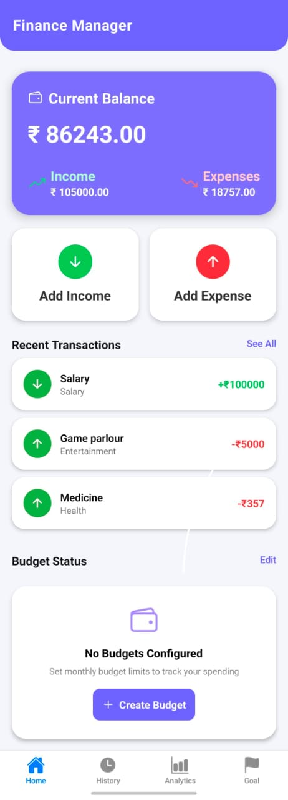
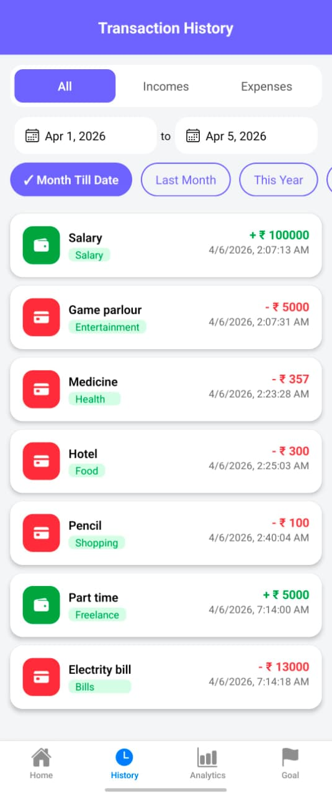
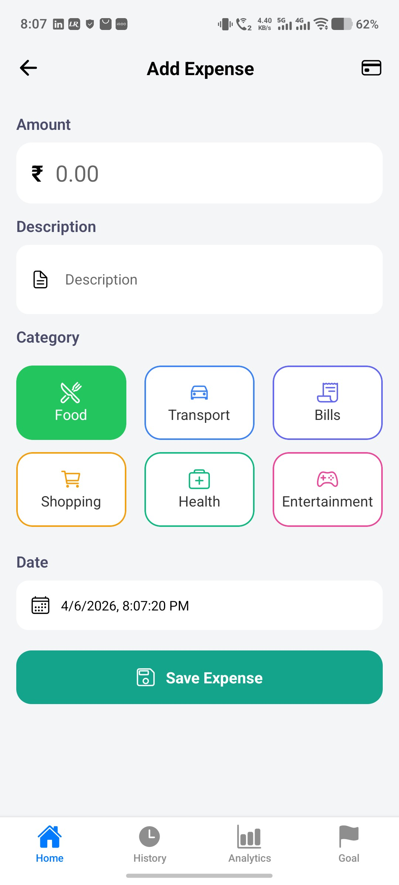
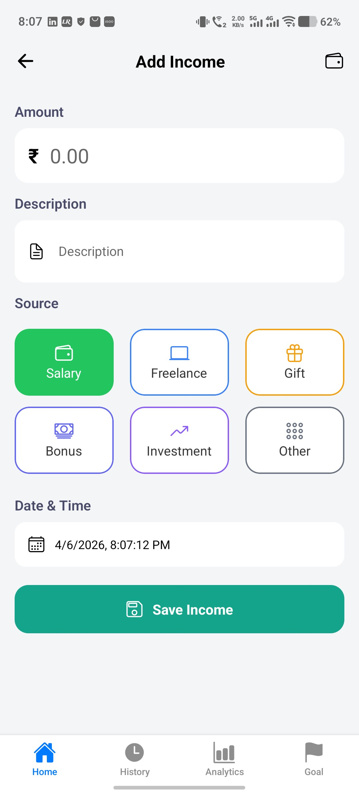
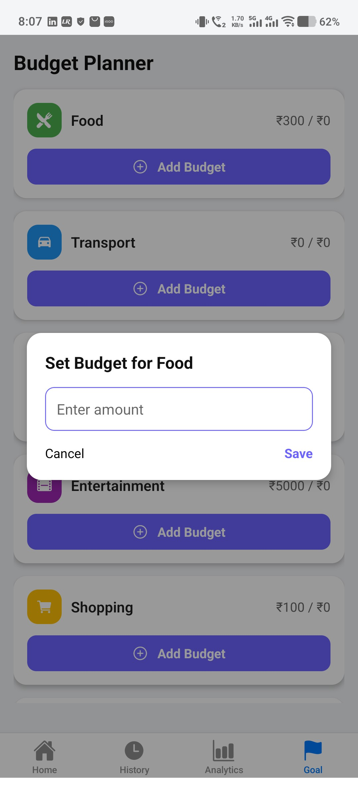
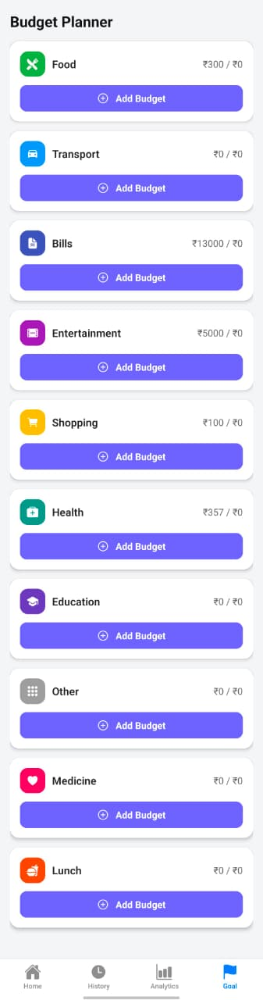
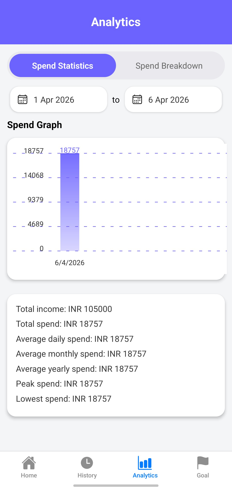

# 📱 Personal Finance Companion

A modern and user-friendly **Personal Finance Tracker** built with **React Native (Expo)** for the mobile frontend and **Node.js + MongoDB** for the backend.

## 🚀 What it does

- Manage income and expense transactions
- Track transaction categories, notes, and dates
- View spending analytics and visual charts
- Use a budget planner to track category limits
- Automatically refresh app data from the backend
- Keep local UI state for instant updates

## 🧩 Project Structure

- `frontend/` — React Native Expo mobile app
  - `App.js` — app entry point
  - `navigation/` — app navigation setup
  - `screens/` — UI screens for home, history, analytics, goals, income, expense, and budget
  - `context/FinanceContext.js` — shared transaction state and backend sync logic
  - `styles/` — component styling

- `backend/` — Express API server
  - `server.js` — server entry point and serverless export
  - `routes/` — API route definitions
  - `controllers/` — business logic for transactions and analytics
  - `models/Transaction.js` — MongoDB transaction schema
  - `config/db.js` — database connection logic

- `screenshots/` — app UI images included for the README

## 📸 Screenshots

The app screenshots are loaded from the local `screenshots/` folder.

### 🏠 Home Screen



### 📜 Transaction History



### 💰 Add Expense



### ➕ Add Income



### 💼 Budget Planner



### 🎯 Goal Planner



### 📊 Analytics Screen



## 🌐 API Endpoints

| Method | Endpoint               | Description          |
| ------ | ---------------------- | -------------------- |
| GET    | /api/transactions      | Get all transactions |
| POST   | /api/transactions      | Add transaction      |
| PUT    | /api/transactions/:id  | Update transaction   |
| DELETE | /api/transactions/:id  | Delete transaction   |
| GET    | /api/analytics/summary | Get analytics data   |

## ⚙️ Run Locally

### Backend Setup

```bash
cd backend
npm install
npm start
```

Create a `.env` file:

```text
MONGO_URI=your_mongodb_connection_string
```

### Frontend Setup

```bash
cd frontend
npm install
npm start
```

## ⚠️ Important Notes

- Start the backend before opening the frontend
- Update the API URL in `frontend/context/FinanceContext.js`
- Use your local IP address rather than `localhost` when testing on a physical device

Example:

```js
const BASE_URL = "http://192.168.X.X:5000";
```

## 🛠 Tech Stack

### Frontend

- React Native (Expo)
- React Navigation
- Context API
- React Native Chart Kit

### Backend

- Node.js
- Express.js
- MongoDB with Mongoose

## 🚀 Future Improvements

- User authentication (login/signup)
- Cloud sync and backup
- Enhanced analytics and insights
- Dark mode support

## 👨‍💻 Author

**Lalit Singh**
📍 Bhubaneswar, India

## 📄 License

This project is open-source and available under the **MIT License**.
